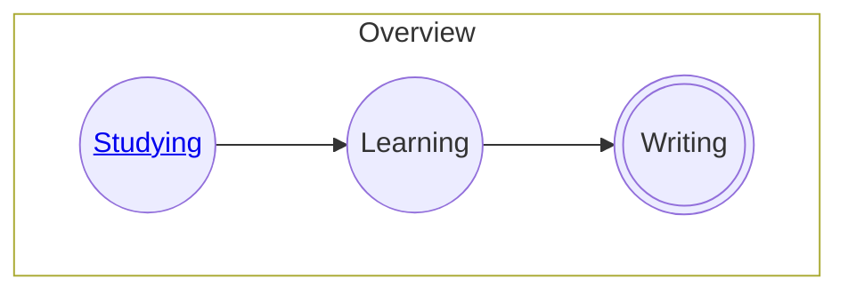
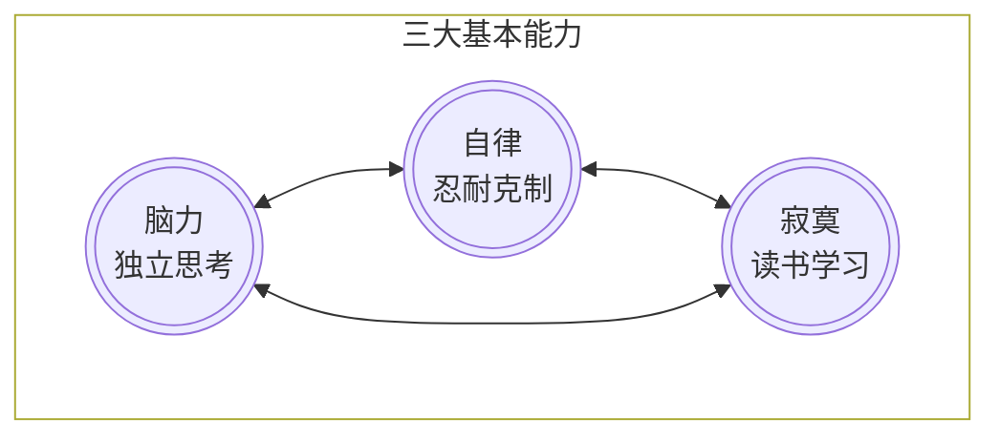

```mermaid
flowchart TB
  subgraph overview [Overview]
    direction LR
    studying((<a href='./studying/readme.md'>Studying</a>)) --> learning((Learning)) --> writing(((Writing)))
  end
  style overview fill:#fff
```

```mermaid
flowchart TB
  subgraph abilities [三大基本能力]
    direction LR
    brains(((脑力\n独立思考))) <--> self-discipline(((自律\n忍耐克制)))
    self-discipline(((自律\n忍耐克制))) <--> loneliness(((寂寞\n读书学习)))
    loneliness(((寂寞\n读书学习))) <--> brains(((脑力\n独立思考)))
  end
  style abilities fill:#fff
```
