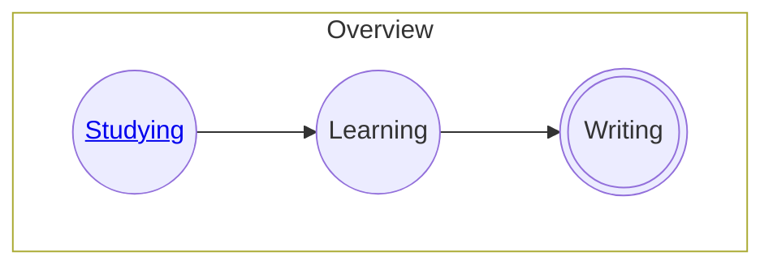
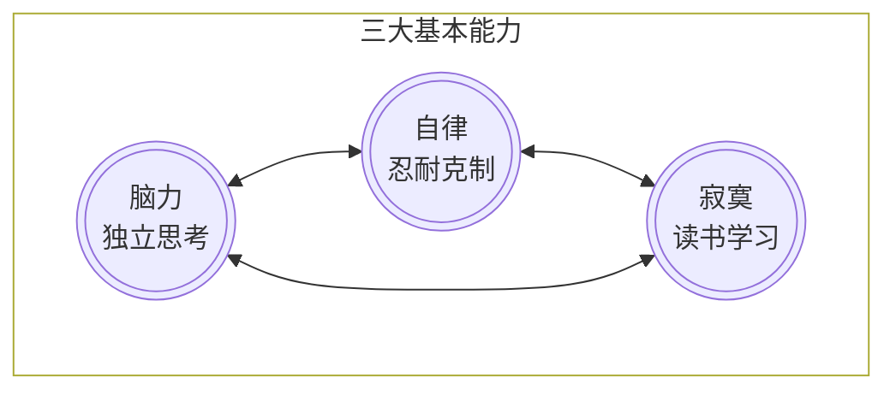

<table>
  <tr>
    <th>索引</th><th>分类</th><th>书目</th><th>状态</th><th>时间</th>
  </tr>
  <tr>
    <td>1</td>
    <td rowspan="3">计算机基础</td>
    <td><a href="./dev-manual/readme.md">计算机操作系统</a></td>
    <td>ㄨ</td>
    <td></td>
  </tr>
</table>
