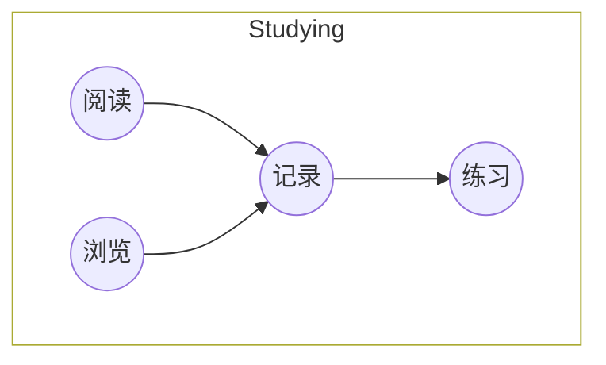

# Studying

## 阅读

| 索引 | 书目                       | 状态 | 时间 |
| ---- | -------------------------- | ---- | ---- |
| 1    | Kubernetes 权威指南        | ㄨ   |      |
| 2    | 亿级流量网站架构核心技术   | ㄨ   |      |
| 3    | Redis 深度历险             | ㄨ   |      |
| 4    | HBase 权威指南             | ㄨ   |      |
| 5    | 深入理解 Java 虚拟机       | ㄨ   |      |
| 6    | Netty 实战                 | ㄨ   |      |
| 7    | 分布式服务架构             | ㄨ   |      |
| 8    | Spring 源码深度解析        | ㄨ   |      |
| 9    | 深入理解 Kafka             | ㄨ   |      |
| 10   | 机器学习                   | ㄨ   |      |
| 11   | 机器阅读理解               | ㄨ   |      |
| 12   | 动手学深度学习             | ㄨ   |      |
| 13   | 深度学习                   | ㄨ   |      |
| 14   | 自然语言处理               | ㄨ   |      |
| 15   | 从零开始构建企业级推荐系统 | ㄨ   |      |
| 16   | 推荐系统实践               | ㄨ   |      |
| 17   | 精通特征工程               | ㄨ   |      |
| 18   | 深度学习进阶               | ㄨ   |      |
| 19   | HTTP 权威指南              | ㄨ   |      |
| 20   | Linux 操作系统             | ㄨ   |      |
| 21   | 人工智能原理及其应用       | ㄨ   |      |
| 22   | C++ Primer                 | ㄨ   |      |

## 浏览

## 记录

1. 《[Alibaba Java 开发手册](./dev-manual/readme.md)》 - 择取

## 练习
