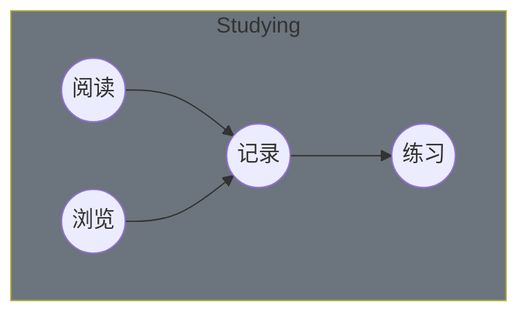

<!-- @import "[TOC]" {cmd="toc" depthFrom=1 depthTo=6 orderedList=false} -->

<!-- code_chunk_output -->

- [Studying](#studying)
  - [2022](#2022)
    - [Objectives](#objectives)
    - [Keys](#keys)
    - [Results](#results)
  - [阅读](#阅读)
  - [Computer Basic](#computer-basic)
  - [Java](#java)
  - [数据库](#数据库)
  - [系统设计](#系统设计)
  - [面向对象](#面向对象)
  - [实践](#实践)
  - [Algorithm](#algorithm)
  - [Hadoop](#hadoop)
- [Todo](#todo)
- [Skill](#skill)
  - [语言栈](#语言栈)
  - [大数据](#大数据)
  - [数据分析](#数据分析)
  - [容器](#容器)
  - [浏览](#浏览)
  - [记录](#记录)
  - [练习](#练习)
  - [20211206](#20211206)
  - [20211207](#20211207)
  - [20211208](#20211208)
  - [20211209](#20211209)
  - [20211210](#20211210)
  - [20211214](#20211214)
  - [20211215](#20211215)
  - [20211216](#20211216)
  - [20211217](#20211217)
  - [缓存案例 - 20220121](#缓存案例-20220121)

<!-- /code_chunk_output -->

# Studying

## 2022

### Objectives

1. 成家
2. 创作（技术与文学）
3. 修心（情绪）
4. 沟通（说话）

### Keys

20220221 ~ 20220225

1. 创作？

### Results

## 阅读

| 索引 | 书目                       | 状态 | 时间       |
| ---- | -------------------------- | ---- | ---------- |
| 1    | Kubernetes 权威指南        | ㄨ   |            |
| 2    | 亿级流量网站架构核心技术   | ㄨ   |            |
| 3    | Redis 深度历险             | ㄨ   |            |
| 4    | HBase 权威指南             | ㄨ   |            |
| 5    | 深入理解 Java 虚拟机       | ㄨ   |            |
| 6    | Netty 实战                 | ㄨ   |            |
| 7    | 分布式服务架构             | ㄨ   |            |
| 8    | Spring 源码深度解析        | ㄨ   |            |
| 9    | 深入理解 Kafka             | ㄨ   |            |
| 10   | 机器学习                   | ㄨ   |            |
| 11   | 机器阅读理解               | ㄨ   |            |
| 12   | 动手学深度学习             | ㄨ   |            |
| 13   | 深度学习                   | ㄨ   |            |
| 14   | 自然语言处理               | ㄨ   |            |
| 15   | 从零开始构建企业级推荐系统 | ㄨ   |            |
| 16   | 推荐系统实践               | ㄨ   |            |
| 17   | 精通特征工程               | ㄨ   |            |
| 18   | 深度学习进阶               | ㄨ   |            |
| 19   | HTTP 权威指南              | ㄨ   |            |
| 20   | Linux 操作系统             | ㄨ   |            |
| 21   | 人工智能原理及其应用       | ㄨ   |            |
| 22   | C++ Primer                 | ㄨ   |            |
| 23   | Alibaba Java 开发手册      | √    | 2022-06-10 |

## Computer Basic

- [计算机操作系统](./computer/os/readme.md)
- [Linux](./computer/os/linux/centos/readme.md)
- [计算机网络](.)
- HTTP
- Socket

## Java

- Java 基础
- Java 容器
- Java 并发
- Java 虚拟机
- Java I/O

## 数据库

- 数据库系统原理
- SQL 语法
- SQL 练习
- MySQL
- Redis

## 系统设计

- 系统设计基础
- [分布式](./java/distributed/readme.md)
- 集群
- 攻击技术
- 缓存
- 消息队列

## 面向对象

- 面向对象思想
- 设计模式

## 实践

- Git
- Docker
- 构建工具
- 正则表达式
- 代码可读性
- 代码风格规范

## Algorithm

- 算法
- Leetcode
- 剑指
- 算法图解

## Hadoop

- MapReduce
- HDFS
- YARN
- Hadoop IO
- MapReduce 应用开发

# Todo

- [Nacos](https://nacos.io/zh-cn/docs/architecture.html)
- Sentinel
- Seata
- Python
- Django
- [Kafka]()
- Java
- Spring
- Scala
- Spark
- gRPC
- shell
- RabbitMQ
- Zabbix

# Skill

## 语言栈

- Java
- Python
- Go
- JavaScript
- shell
- C#
- Scala

## 大数据

- Hadoop
- Hive
- Spark
- Flink
- Kafka
- HBase
- ElasticSearch
- Logstash
- Kibana
- Powerdesigner

## 数据分析

- numpy
- pandas
- beautifulsoup
- matplotlib
- scikit-learn
- 文本分析

## 容器

- Docker
- K8S

## 浏览

## 记录

1. 《[Alibaba Java 开发手册](./dev-manual/readme.md)》 - 择取

## 练习

## 20211206

- 《分布式服务架构：原理、设计与实战》

1. 分布式微服务架构设计原理

   - 从服务话到微服务化

2. 分布式系统一致性问题
3. 服务化系统容量评估与性能保障
4. 日志系统构建
5. 基于调用链的服务治理系统
6. 线上应急和技术攻关
7. 服务的容器化过程
8. 敏捷开发 2.0 与自动化工具

## 20211207

1. 分布式微服务架构设计原理

   1.3 微服务架构的核心要点和实现原理
   1.3.1 架构与职能团队划分
   1.3.2 去中心化治理
   1.3.3 交互模式

## 20211208

1.3.4 微服务的分解与组合模式

## 20211209

1.3.5 微服务的容错模式
1.3.6 微服务粒度
1.4 微服务架构组织形式
1.5 微服务管理与服务治理

## 20211210

2. 彻底解决分布式系统一致性问题

## 20211214

2. 彻底解决分布式系统一致性问题

本周范围: 亿级流量 - 第一第二章

## 20211215

1. 交易型系统设计的一些原则

## 20211216

2. 高可用

## 20211217

## 缓存案例 - 20220121

1. 元数据缓存（客户端-浏览器，服务端，数据库，设计器）
2. 文档缓存（pos-backend，pos，redis，doc，mysql）
