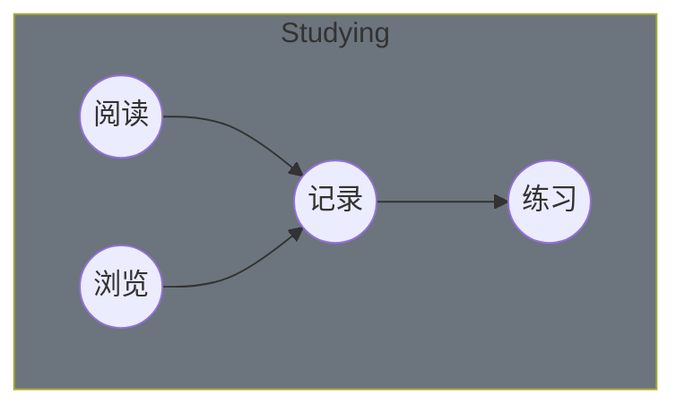

<!-- @import "[TOC]" {cmd="toc" depthFrom=1 depthTo=6 orderedList=false} -->

<!-- code_chunk_output -->

- [Basic](#basic)
- [Language](#language)
- [Engineering](#engineering)
- [ML](#ml)

<!-- /code_chunk_output -->

# Basic

| 索引 | 分类    | 书目                                    | 状态 | 时间 |
| ---- | ------- | --------------------------------------- | ---- | ---- |
|      | Basic   | [计算机操作系统](./os/readme.md)        | ㄨ   |      |
|      | Basic   | [计算机网络](./network/readme.md)       | ㄨ   |      |
|      | Basic   | [Linux 操作系统](./linux/readme.md)     | ㄨ   |      |
|      | Network | [HTTP 权威指南](./http/readme.md)       | ㄨ   |      |
|      | Basic   | [CyC2018/CS-Notes](./cs-note/readme.md) | ㄨ   |      |

# Language

| 索引 | 分类 | 书目                                            | 状态 | 时间       |
| ---- | ---- | ----------------------------------------------- | ---- | ---------- |
|      | C++  | [C++ Primer]()                                  | ㄨ   |            |
|      | Java | [Spring 源码深度解析]()                         | ㄨ   |            |
|      | Java | [深入理解 Java 虚拟机]()                        | ㄨ   |            |
|      | Java | [Alibaba Java 开发手册](./dev-manual/readme.md) | √    | 2022-06-10 |

# Engineering

| 索引 | 分类     | 书目                                                   | 状态 | 时间 |
| ---- | -------- | ------------------------------------------------------ | ---- | ---- |
|      | Database | [Redis 深度历险]()                                     | ㄨ   |      |
|      | OLTP     | [HBase 权威指南]()                                     | ㄨ   |      |
|      | MQ       | [深入理解 Kafka]()                                     | ㄨ   |      |
|      | Network  | [Netty 实战]()                                         | ㄨ   |      |
|      | Cloud    | [Kubernetes 权威指南]()                                | ㄨ   |      |
|      | Cloud    | [亿级流量网站架构核心技术]()                           | ㄨ   |      |
|      | Cloud    | [分布式服务架构]()                                     | ㄨ   |      |
|      | Bigdata  | [Hadoop 权威指南](./hadoop/readme.md)                  | √    |      |
|      | Bigdata  | [Spark]()                                              | ㄨ   |      |
|      | Cloud    | [Nacos](https://nacos.io/zh-cn/docs/architecture.html) | ㄨ   |      |
|      | Cloud    | [Sentinel]()                                           | ㄨ   |      |
|      | Cloud    | [Seata]()                                              | ㄨ   |      |
|      | Web      | [Django]()                                             | ㄨ   |      |
|      | Network  | [gRPC]()                                               | ㄨ   |      |
|      | Bigdata  | [Flink]()                                              | ㄨ   |      |
|      | Bigdata  | [ElasticSearch]()                                      | ㄨ   |      |

# ML

| 索引 | 分类 | 书目                           | 状态 | 时间 |
| ---- | ---- | ------------------------------ | ---- | ---- |
|      | ML   | [机器学习]()                   | ㄨ   |      |
|      | ML   | [机器阅读理解]()               | ㄨ   |      |
|      | ML   | [动手学深度学习]()             | ㄨ   |      |
|      | ML   | [深度学习]()                   | ㄨ   |      |
|      | ML   | [自然语言处理]()               | ㄨ   |      |
|      | ML   | [从零开始构建企业级推荐系统]() | ㄨ   |      |
|      | ML   | [推荐系统实践]()               | ㄨ   |      |
|      | ML   | [精通特征工程]()               | ㄨ   |      |
|      | ML   | [深度学习进阶]()               | ㄨ   |      |
|      | ML   | [人工智能原理及其应用]()       | ㄨ   |      |
