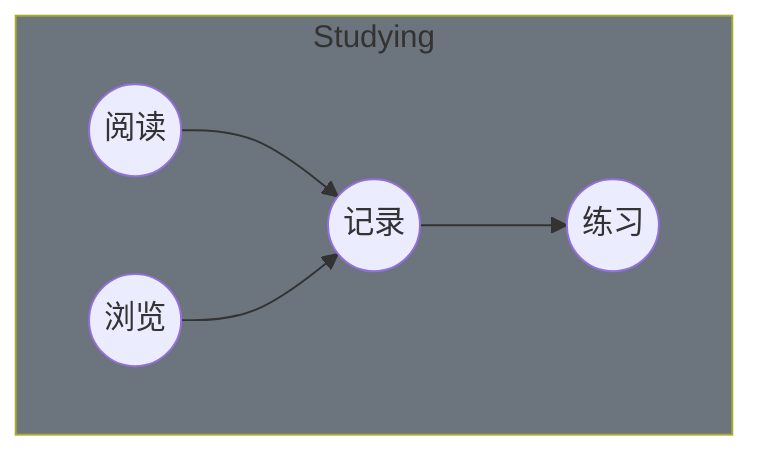

<!-- @import "[TOC]" {cmd="toc" depthFrom=1 depthTo=6 orderedList=false} -->

<!-- code_chunk_output -->

- [Studying](#studying)
  - [阅读](#阅读)
  - [Computer Basic](#computer-basic)
  - [Java](#java)
  - [数据库](#数据库)
  - [系统设计](#系统设计)
  - [面向对象](#面向对象)
  - [实践](#实践)
  - [Algorithm](#algorithm)
  - [Hadoop](#hadoop)
- [Todo](#todo)
- [Skill](#skill)
  - [语言栈](#语言栈)
  - [大数据](#大数据)
  - [数据分析](#数据分析)
  - [容器](#容器)
  - [浏览](#浏览)
  - [记录](#记录)
  - [练习](#练习)

<!-- /code_chunk_output -->

# Studying

## 阅读

| 索引 | 书目                       | 状态 | 时间       |
| ---- | -------------------------- | ---- | ---------- |
| 1    | Kubernetes 权威指南        | ㄨ   |            |
| 2    | 亿级流量网站架构核心技术   | ㄨ   |            |
| 3    | Redis 深度历险             | ㄨ   |            |
| 4    | HBase 权威指南             | ㄨ   |            |
| 5    | 深入理解 Java 虚拟机       | ㄨ   |            |
| 6    | Netty 实战                 | ㄨ   |            |
| 7    | 分布式服务架构             | ㄨ   |            |
| 8    | Spring 源码深度解析        | ㄨ   |            |
| 9    | 深入理解 Kafka             | ㄨ   |            |
| 10   | 机器学习                   | ㄨ   |            |
| 11   | 机器阅读理解               | ㄨ   |            |
| 12   | 动手学深度学习             | ㄨ   |            |
| 13   | 深度学习                   | ㄨ   |            |
| 14   | 自然语言处理               | ㄨ   |            |
| 15   | 从零开始构建企业级推荐系统 | ㄨ   |            |
| 16   | 推荐系统实践               | ㄨ   |            |
| 17   | 精通特征工程               | ㄨ   |            |
| 18   | 深度学习进阶               | ㄨ   |            |
| 19   | HTTP 权威指南              | ㄨ   |            |
| 20   | Linux 操作系统             | ㄨ   |            |
| 21   | 人工智能原理及其应用       | ㄨ   |            |
| 22   | C++ Primer                 | ㄨ   |            |
| 23   | Alibaba Java 开发手册      | √    | 2022-06-10 |

## Computer Basic

- [计算机操作系统](./computer/os/readme.md)
- [Linux](./computer/os/linux/centos/readme.md)
- [计算机网络](.)
- HTTP
- Socket

## Java

- Java 基础
- Java 容器
- Java 并发
- Java 虚拟机
- Java I/O

## 数据库

- 数据库系统原理
- SQL 语法
- SQL 练习
- MySQL
- Redis

## 系统设计

- 系统设计基础
- [分布式](./java/distributed/readme.md)
- 集群
- 攻击技术
- 缓存
- 消息队列

## 面向对象

- 面向对象思想
- 设计模式

## 实践

- Git
- Docker
- 构建工具
- 正则表达式
- 代码可读性
- 代码风格规范

## Algorithm

- 算法
- Leetcode
- 剑指
- 算法图解

## Hadoop

- MapReduce
- HDFS
- YARN
- Hadoop IO
- MapReduce 应用开发

# Todo

- [Nacos](https://nacos.io/zh-cn/docs/architecture.html)
- Sentinel
- Seata
- Python
- Django
- [Kafka]()
- Java
- Spring
- Scala
- Spark
- gRPC
- shell
- RabbitMQ
- Zabbix

# Skill

## 语言栈

- Java
- Python
- Go
- JavaScript
- shell
- C#
- Scala

## 大数据

- Hadoop
- Hive
- Spark
- Flink
- Kafka
- HBase
- ElasticSearch
- Logstash
- Kibana
- Powerdesigner

## 数据分析

- numpy
- pandas
- beautifulsoup
- matplotlib
- scikit-learn
- 文本分析

## 容器

- Docker
- K8S

## 浏览

## 记录

1. 《[Alibaba Java 开发手册](./dev-manual/readme.md)》 - 择取

## 练习
